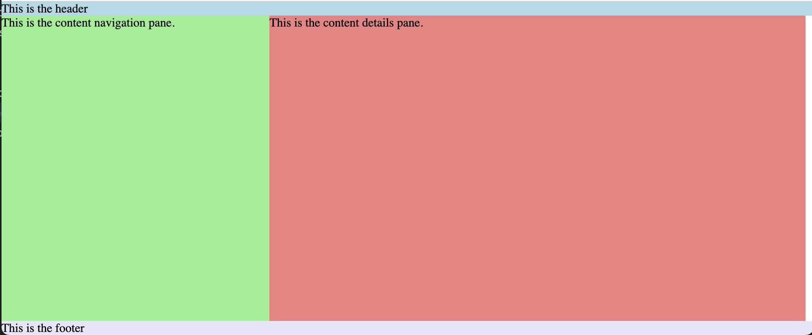
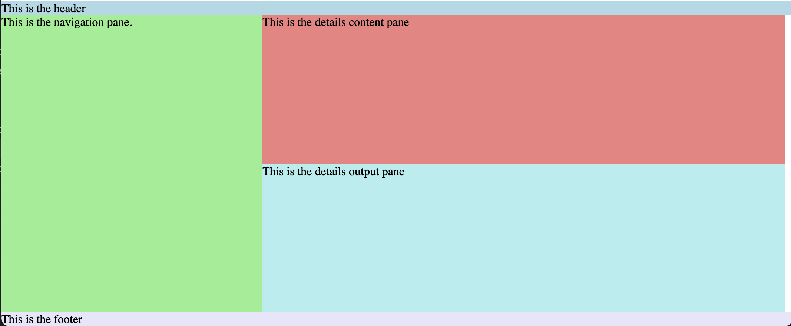

# Overview

This takes you through the steps of creating a Fluent UI React web application that uses v8 and v9 side-by-side. At the time of this writing, v9 latest is 9.0.0.rc-11.

# Create the v8 application

1. Use the create react app (CRA) template

`yarn create react-app fluentui-app-v8-v9 --template @fluentui/cra-template`

2. Install dependencies and build/run.

`yarn install`

`yarn start`

3. Verify you see the standard spinning react logo with the 'Welcome to your Fluent UI app' message.

# Remove v8 application boilerplate

1. Delete App.css
2. Delete App.test.tsx
3. Update App.tsx to render hello world
4. Delete logo.svg
5. Verify the app still runs with `yarn start`

```tsx
import React from "react";

export const App: React.FunctionComponent = () => {
  return <div>Hello Fluent UI React v9</div>;
};
```

# Add the v9 react-components package

1. Add react-components

`yarn add @fluentui/react-components`

You should now see "@fluentui/react-components": "^9.0.0-rc.11" in the dependencies of package.json.

# Create the application layout

The application will have a typical single-page-application (SPA) layout.
There will be header, content, and footer rows.
The content will be divided into navigation and details columns.

1. Use makestyles to define the top-level application layout

```tsx
import React from "react";
import { makeStyles } from "@fluentui/react-components";

const useStyles = makeStyles({
  app: {
    display: "grid",
    gridTemplateColumns: "1fr",
    gridTemplateRows: "auto 1fr auto",
    width: "100%",
    height: "100%",
  },
  header: {
    backgroundColor: "lightblue",
  },
  content: {
    display: "grid",
    gridTemplateColumns: "33% 66%",
    gridTemplateRows: "1fr",
  },
  nav: {
    backgroundColor: "lightgreen",
  },
  details: {
    backgroundColor: "lightcoral",
  },
  footer: {
    backgroundColor: "lavender",
  },
});

export const App: React.FunctionComponent = () => {
  const styles = useStyles();

  return (
    <div className={styles.app}>
      <div className={styles.header}>This is the header</div>
      <div className={styles.content}>
        <div className={styles.nav}>This is the content navigation pane.</div>
        <div className={styles.details}>This is the content details pane.</div>
      </div>
      <div className={styles.footer}>This is the footer</div>
    </div>
  );
};
```

This will create this layout:



2. Create a new Details.tsx component with content and output rows

```tsx
import React from "react";
import { makeStyles } from "@fluentui/react-components";

const useStyles = makeStyles({
  details: {
    display: "grid",
    gridTemplateColumns: "1fr",
    gridTemplateRows: "1fr auto",
    height: "100%",
  },
  content: {
    backgroundColor: "lightcoral",
  },
  output: {
    backgroundColor: "paleturquoise",
    minHeight: "200px",
  },
});

export const Details: React.FunctionComponent = () => {
  const styles = useStyles();

  return (
    <div className={styles.details}>
      <div className={styles.content}>This is the details content pane</div>
      <div className={styles.output}>This is the details output pane</div>
    </div>
  );
};
```

Use the Details component in App.tsx

```tsx
//...
<div className={styles.content}>
  <div className={styles.nav}>This is the navigation pane.</div>
  <div className={styles.details}>
    <Details />
  </div>
</div>
//...
```

You should now see this layout:

