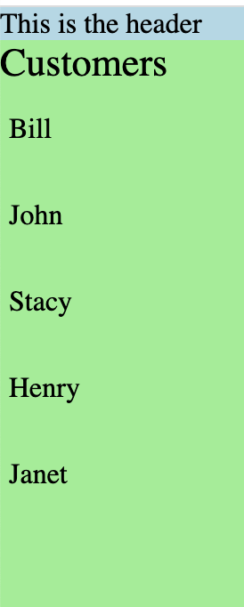
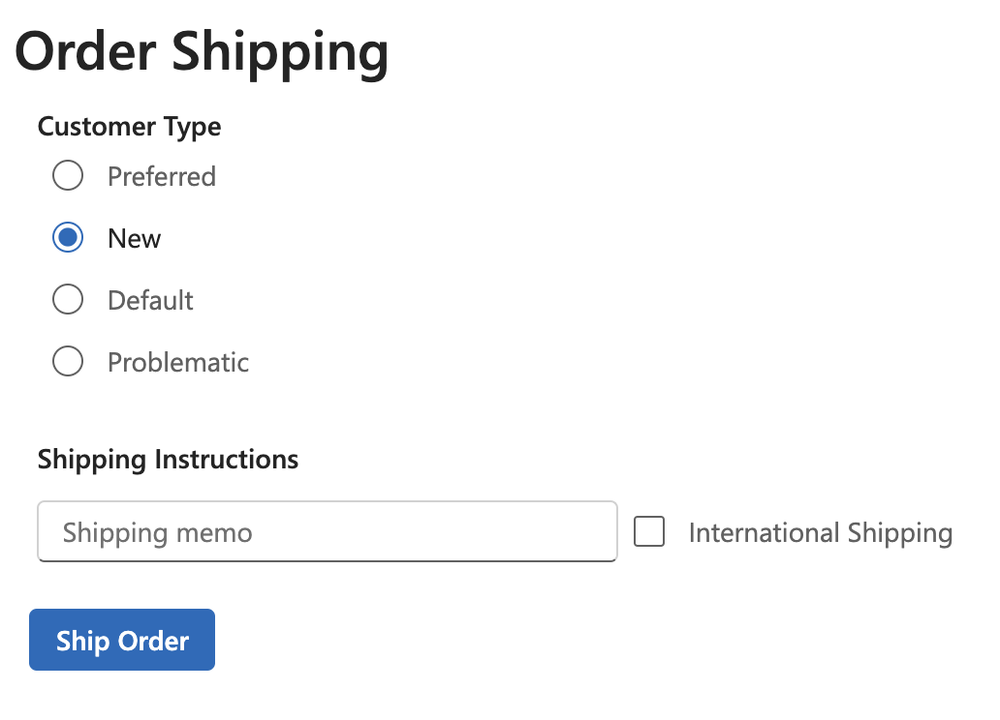
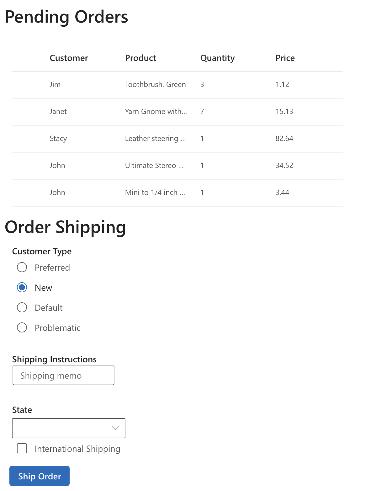

# Overview

This takes you through the steps of creating a Fluent UI React web application that uses v8 and v9 side-by-side. At the time of this writing, v9 latest is 9.0.0.rc-11.

When starting a new application that uses both v8 and v9, there are guidelines that will help you get the most value from v9 while avoiding the pitfalls and incompatibilities of v8:
- Avoid using the styles property and JS style objects with v8 components.
- Do not use the Stack component from v8. Do layout with CSS grid and flex.
- Follow the v9 styling, hooks, and infrastructure patterns when building a component from scratch.
- When implementing render props callbacks with v8 components, keep in mind that v9 components use slots and children. The more portable you make your code to map functions in the future, the better off you will be. 

# Create the v8 application

1. Use the create react app (CRA) template

`yarn create react-app fluentui-app-v8-v9 --template @fluentui/cra-template`

2. Install dependencies and build/run.

`yarn install`

`yarn start`

3. Verify you see the standard spinning react logo with the 'Welcome to your Fluent UI app' message.

# Remove v8 application boilerplate

1. Delete App.css
2. Delete App.test.tsx
3. Update App.tsx to render hello world
4. Delete logo.svg
5. Verify the app still runs with `yarn start`

```tsx
import React from "react";

export const App: React.FunctionComponent = () => {
  return <div>Hello Fluent UI React v9</div>;
};
```

# Add the v9 react-components package

1. Add react-components

`yarn add @fluentui/react-components`

You should now see "@fluentui/react-components": "^9.0.0-rc.11" in the dependencies of package.json.

# Create the application layout

The application will have a typical single-page-application (SPA) layout.
There will be header, content, and footer rows.
The content will be divided into navigation and details columns.

1. Use makestyles to define the top-level application layout

```tsx
import React from "react";
import { makeStyles } from "@fluentui/react-components";

const useStyles = makeStyles({
  app: {
    display: "grid",
    gridTemplateColumns: "1fr",
    gridTemplateRows: "auto 1fr auto",
    width: "100%",
    height: "100%",
  },
  header: {
    backgroundColor: "lightblue",
  },
  content: {
    display: "grid",
    gridTemplateColumns: "30% 70%",
    gridTemplateRows: "1fr",
  },
  nav: {
    backgroundColor: "lightgreen",
  },
  details: {
    backgroundColor: "lightcoral",
  },
  footer: {
    backgroundColor: "lavender",
  },
});

export const App: React.FunctionComponent = () => {
  const styles = useStyles();

  return (
    <div className={styles.app}>
      <div className={styles.header}>This is the header</div>
      <div className={styles.content}>
        <div className={styles.nav}>This is the content navigation pane.</div>
        <div className={styles.details}>This is the content details pane.</div>
      </div>
      <div className={styles.footer}>This is the footer</div>
    </div>
  );
};
```

This will create this layout:


2. Create a new Details.tsx component with content and output rows

```tsx
import React from "react";
import { makeStyles } from "@fluentui/react-components";

const useStyles = makeStyles({
  details: {
    display: "grid",
    gridTemplateColumns: "1fr",
    gridTemplateRows: "1fr auto",
    height: "100%",
  },
  content: {
    backgroundColor: "lightcoral",
  },
  output: {
    backgroundColor: "paleturquoise",
    minHeight: "200px",
  },
});

export const Details: React.FunctionComponent = () => {
  const styles = useStyles();

  return (
    <div className={styles.details}>
      <div className={styles.content}>This is the details content pane</div>
      <div className={styles.output}>This is the details output pane</div>
    </div>
  );
};
```

Use the Details component in App.tsx

```tsx
//...
<div className={styles.content}>
  <div className={styles.nav}>This is the navigation pane.</div>
  <div className={styles.details}>
    <Details />
  </div>
</div>
//...
```

> You should now see this layout:


# Add navigation with a v8 List

1. Create a Navigation.tsx component

The left-hand navigation will be a list of customers.
This initial list does not have selection.

```tsx
import React, { ReactNode } from "react";
import { makeStyles, shorthands } from "@fluentui/react-components";
import { List } from "@fluentui/react";

const useStyles = makeStyles({
  navigation: {
    display: "grid",
    gridTemplateColumns: "1fr",
    gridTemplateRows: "auto 1fr",
    height: "100%",
  },
  header: {
    fontSize: "22px",
  },
  list: {
  },
  customer: {
    ...shorthands.padding("15px", "5px"),
    }
  },
});

type CustomerListItem = {
  key: string;
  name: string;
};

const items: CustomerListItem[] = [
  {
    key: "1",
    name: "Bill",
  },
  {
    key: "2",
    name: "John",
  },
  {
    key: "3",
    name: "Stacy",
  },
  {
    key: "4",
    name: "Henry",
  },
  {
    key: "5",
    name: "Janet",
  },
];

export const Navigation: React.FunctionComponent = () => {
  const styles = useStyles();

  const onRenderCustomer = (item?: CustomerListItem): ReactNode => {
    if (item) {
    // v9 styles can be used when rendering item in v8 render props callbacks
      return (
        <div className={styles.customer} key={item.key}>
          {item.name}
        </div>
      );
    }

    return null;
  };

  // This uses the v8 List component
  return (
    <div className={styles.navigation}>
      <div className={styles.header}>Customers</div>
      <div className={styles.list}>
        <List items={items} onRenderCell={onRenderCustomer} />
      </div>
    </div>
  );
};
```

> You should now see this in the navigation:



# Add v8 and v9 form controls

This step adds `Button`, `Checkbox`, `Input`, `Label` and `Radio` for controls from v9 and `DetailsList` and `ComboBox` from v8.

## Add FluentProvider to styles v9 components

1. In App.tsx, replace the app `div` with `FluentProvider`. Apply the `webLightTheme`.

This will allow the v9 controls to render correctly.

```tsx
return (
  <FluentProvider className={styles.app} theme={webLightTheme}>
    {...}
  </FluentProvider>
);
```

2. In App.tsx, remove the bright colors and use the v9 design tokens for backgrounds and borders

```tsx
const useStyles = makeStyles({
  app: {
    backgroundColor: tokens.colorNeutralBackground1,
    display: "grid",
    gridTemplateColumns: "1fr",
    gridTemplateRows: "auto 1fr auto",
    height: "100%",
    width: "100%",
  },
  header: {
    ...shorthands.borderBottom(
      tokens.strokeWidthThin,
      "solid",
      tokens.colorNeutralStroke1
    ),
  },
  content: {
    display: "grid",
    gridTemplateColumns: "33% 66%",
    gridTemplateRows: "1fr",
  },
  nav: {
    ...shorthands.borderRight(
      tokens.strokeWidthThin,
      "solid",
      tokens.colorNeutralStroke1
    ),
  },
  details: {},
  footer: {
    ...shorthands.borderTop(
      tokens.strokeWidthThin,
      "solid",
      tokens.colorNeutralStroke1
    ),
  },
});
```

## Add v9 components to Details.tsx

```tsx
import React from "react";
import {
  Button,
  Checkbox,
  Input,
  Label,
  makeStyles,
  Radio,
  RadioGroup,
  shorthands,
  Title2,
  tokens,
} from "@fluentui/react-components";

const useStyles = makeStyles({
  details: {
    display: "grid",
    gridTemplateColumns: "1fr",
    gridTemplateRows: "1fr auto",
    height: "100%",
    ...shorthands.margin(tokens.spacingHorizontalM),
  },
  content: {
    display: "flex",
    flexDirection: "column",
    alignItems: "flex-start",
    justifyItems: "center",
  },
  section: {
    ...shorthands.margin(tokens.spacingHorizontalM),
  },
  instructions: {
    display: "flex",
    flexDirection: "row",
    "& > :first-child": {
      minWidth: "300px",
    },
    "& > *": {
      ...shorthands.margin(tokens.spacingHorizontalM, 0),
    },
  },
  shipAction: {
    ...shorthands.margin(0, 0, 0, tokens.spacingHorizontalS),
  },
  output: {
    minHeight: "200px",
    ...shorthands.borderTop(
      tokens.strokeWidthThin,
      "solid",
      tokens.colorNeutralStroke1
    ),
  },
});

export const Details: React.FunctionComponent = () => {
  const styles = useStyles();

  return (
    <div className={styles.details}>
      <div className={styles.content}>
        <Title2>Order Shipping</Title2>
        <div className={styles.section}>
          <Label id="CustomerTypeLabel" strong>
            Customer Type
          </Label>
          <RadioGroup aria-labelledby="CustomerTypeLabel">
            <Radio label="Preferred" value="preferred" />
            <Radio label="New" value="new" checked />
            <Radio label="Default" value="default" />
            <Radio label="Problematic" value="problematic " />
          </RadioGroup>
        </div>
        <div className={styles.section}>
          <Label id="Shipping Instructions" strong>
            Shipping Instructions
          </Label>
          <div className={styles.instructions}>
            <Input placeholder="Shipping memo" />
            <Checkbox label="International Shipping" />
          </div>
        </div>
        <Button className={styles.shipAction} appearance="primary">
          Ship Order
        </Button>
      </div>
      <div className={styles.output}>This is the details output pane</div>
    </div>
  );
};
```

> You should now see this in the details view:



## Initialize icons and add ThemeProvider to style v8 components

1. In index.tsx, add a call to initializeIcons

This will allow v8 controls to render correctly.

```tsx
import { initializeIcons } from "@fluentui/react";

initializeIcons();
```

2. In App.tsx, add the ThemeProvider.

This will allow v8 form controls to render correctly.

```tsx
// Adjust the theme provider style for a single-page-app
const themeProviderStyle = {
  height: "100%",
    width: "100%",
}

//...

<ThemeProvider style={themeProviderStyle}>
  <FluentProvider className={styles.app} theme={webLightTheme}>
    {...}
    </FluentProvider>
</ThemeProvider>
```

## Add v8 DetailsList to Details.tsx

1. Add the order colums for the `DetailsList`

```tsx
const orderColumns = [
  {
    key: "column1",
    name: "Customer",
    fieldName: "customer",
    minWidth: 100,
    maxWidth: 200,
    isResizable: true,
  },
  {
    key: "column2",
    name: "Product",
    fieldName: "product",
    minWidth: 100,
    maxWidth: 200,
    isResizable: true,
  },
  {
    key: "column3",
    name: "Quantity",
    fieldName: "quantity",
    minWidth: 100,
    maxWidth: 200,
    isResizable: true,
  },
  {
    key: "column4",
    name: "Price",
    fieldName: "price",
    minWidth: 100,
    maxWidth: 200,
    isResizable: true,
  },
];
```

2. Add the order items for the `DetailsList`

```tsx
type OrderListItem = {
  key: string;
  customer: string;
  product: string;
  quantity: number;
  price: number;
};

const orders: OrderListItem[] = [
  {
    key: "order1",
    customer: "Jim",
    product: "Toothbrush, Green",
    quantity: 3,
    price: 1.12,
  },
  {
    key: "order2",
    customer: "Janet",
    product: "Yarn Gnome with hut, 18 inches",
    quantity: 7,
    price: 15.13,
  },
  {
    key: "order3",
    customer: "Stacy",
    product: "Leather steering wheel cover",
    quantity: 1,
    price: 82.64,
  },
  {
    key: "order4",
    customer: "John",
    product: "Ultimate Stereo Headphones",
    quantity: 1,
    price: 34.52,
  },
  {
    key: "order5",
    customer: "John",
    product: "Mini to 1/4 inch stereo cable adapter",
    quantity: 1,
    price: 3.44,
  },
];
```

3. Add the DetailsList as a new section

```tsx
return (
  <div className={styles.details}>
    <div className={styles.content}>
      <Title2>Pending Orders</Title2>
      <div className={styles.section}>
        <DetailsList
          items={orders}
          columns={orderColumns}
          setKey="set"
          layoutMode={DetailsListLayoutMode.justified}
          ariaLabelForSelectionColumn="Toggle selection"
          ariaLabelForSelectAllCheckbox="Toggle selection for all items"
          checkButtonAriaLabel="select row"
        />
      </div>
      {...}
    </div>
  </div>
);
```

## Add v8 ComboBox to Details.tsx

1. Add the states as options for the `ComboBox`

```tsx
const stateOptions: IComboBoxOption[] = [
  { key: "Alabama", text: "Alabama" },
  { key: "Alaska", text: "Alaska" },
  { key: "Arizona", text: "Arizona" },
  { key: "Arkansas", text: "Arkansas" },
  { key: "California", text: "California" },
  { key: "Colorado", text: "Colorado" },
  { key: "Connecticut", text: "Connecticut" },
  { key: "Delaware", text: "Delaware" },
  { key: "Florida", text: "Florida" },
  { key: "Georgia", text: "Georgia" },
  { key: "Hawaii", text: "Hawaii" },
  { key: "Idaho", text: "Idaho" },
  { key: "IllinoisIndiana", text: "IllinoisIndiana" },
  { key: "Iowa", text: "Iowa" },
  { key: "Kansas", text: "Kansas" },
  { key: "Kentucky", text: "Kentucky" },
  { key: "Louisiana", text: "Louisiana" },
  { key: "Maine", text: "Maine" },
  { key: "Maryland", text: "Maryland" },
  { key: "Massachusetts", text: "Massachusetts" },
  { key: "Michigan", text: "Michigan" },
  { key: "Minnesota", text: "Minnesota" },
  { key: "Mississippi", text: "Mississippi" },
  { key: "Missouri", text: "Missouri" },
  { key: "MontanaNebraska", text: "MontanaNebraska" },
  { key: "Nevada", text: "Nevada" },
  { key: "New", text: "New Hampshire" },
  { key: "New", text: "New Jersey" },
  { key: "New", text: "New Mexico" },
  { key: "New", text: "New York" },
  { key: "North", text: "North Carolina" },
  { key: "North", text: "North Dakota" },
  { key: "Ohio", text: "Ohio" },
  { key: "Oklahoma", text: "Oklahoma" },
  { key: "Oregon", text: "Oregon" },
  { key: "Pennsylvania", text: "Pennsylvania" },
  { key: "Rhode", text: "Rhode Island" },
  { key: "South", text: "South Carolina" },
  { key: "South", text: "South Dakota" },
  { key: "Tennessee", text: "Tennessee" },
  { key: "Texas", text: "Texas" },
  { key: "Utah", text: "Utah" },
  { key: "Vermont", text: "Vermont" },
  { key: "Virginia", text: "Virginia" },
  { key: "Washington", text: "Washington" },
  { key: "West", text: "West Virginia" },
  { key: "Wisconsin", text: "Wisconsin" },
  { key: "Wyoming", text: "Wyoming" },
];
```

2. Add the `Combobox` alongside the v9 form controls

```tsx
<div className={styles.section}>
  <Label id="Shipping Instructions" strong>
    Shipping Instructions
  </Label>
  <div>
    <Input placeholder="Shipping memo" />
  </div>
</div>
<div className={styles.section}>
  <ComboBox label="State" options={stateOptions} />
  <Checkbox label="International Shipping" />
</div>
<Button className={styles.shipAction} appearance="primary">
  Ship Order
</Button>
```

> You should now see this in the details view:


